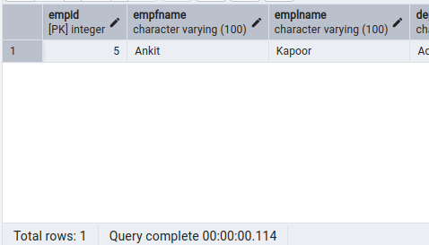
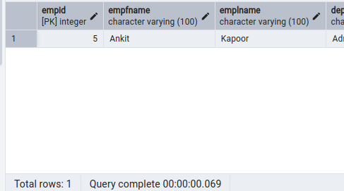

# SQL_DB_Assignment

### Creating Database:

### Creating tables:

### Inserting Records:

`SELECT * FROM EmployeeInfo;`

`SELECT * FROM EmployeePosition;`

### 1. Write a query to fetch the number of employees working in the department ‘Admin’

`SELECT department,count(empid) AS "No. of Employees" FROM EmployeeInfo
GROUP BY department
HAVING department='Admin';`

### 2. Write a query to retrieve the first four characters of EmpLname from the EmployeeInfo table.

`SELECT LEFT(EmpLname, 4) AS "First_Four_Char" from EmployeeInfo;`

`SELECT SUBSTR(EmpLname,1,4) AS "First_Four_Char" from EmployeeInfo;`

### 3. Write q query to find all the employees whose salary is between 50000 to 100000.

`SELECT CONCAT_WS(' ',empfname,emplname) AS "Employee Name", salary from employeeinfo i
INNER JOIN employeeposition p
ON i.empid=p.empid
WHERE p.salary BETWEEN 50000 AND 100000;`

### 4. Write a query to find the names of employees that begin with ‘S’

`SELECT Empfname FROM EmployeeInfo
WHERE Empfname LIKE 'S%';`

### 5. Write a query to fetch top N records order by salary. (ex. top 5 records)

`SELECT ep.empid,ei.empfname,ep.salary FROM EmployeePosition ep
INNER JOIN EmployeeInfo ei
ON ep.empid = ei.empid
ORDER BY ep.salary DESC
LIMIT 5;`

### 6. Write a query to fetch details of all employees excluding the employees with first names,“Sanjay” and “Sonia” from the EmployeeInfo table.

`SELECT * FROM EmployeeInfo
WHERE empfname NOT IN ('Sanjay','Sonia');`

### 7. Write a query to fetch the department-wise count of employees sorted by department’s count in ascending order.

`SELECT department,COUNT(empid) AS "No. of Employees" FROM EmployeeInfo
GROUP BY department
ORDER BY COUNT(empid) ASC;`

### 8. Create indexing for any particular field and show the difference in data fetching before and after indexing

#### Before Indexing fetching data for a particular lastname

`SELECT * FROM EmployeeInfo
WHERE emplname = 'Kapoor';`

#### Creating index on the emplname

`CREATE INDEX lname_idx ON EmployeeInfo(emplname);`

#### After Indexing fetching data for a particular lastname

`SELECT * FROM EmployeeInfo
WHERE emplname = 'Kapoor';`

